# 校园周边美食探索及分享平台

#### 介绍

高校心理教育辅导系统旨在为高校学生提供心理健康教育和辅导服务，同时为管理员提供高效的管理工具。该系统通过分角色设计，分别为管理员和用户（学生）提供特定的功能模块，满足各自的操作需求。

#### 技术栈介绍

后端技术栈：Springboot+Mysql+Maven

前端技术栈：Vue+Html+Css+Javascript+ElementUI

开发工具：Idea+Vscode+Navicate

#### 系统功能介绍

管理员角色

个人中心：管理员可以查看和修改个人信息，管理账户安全设置，确保账户的安全性和个性化设置。

用户管理：管理员可以管理系统内的所有用户信息，包括用户注册、删除和权限设置，确保用户信息的完整性和准确性。

美食鉴赏管理：管理员可以管理和更新美食鉴赏内容，确保内容的丰富性和趣味性，吸引更多用户参与。

我的好友管理：管理员可以管理用户的好友关系，确保用户间互动的和谐和安全。

我的收藏管理：管理员可以查看和管理用户的收藏内容，确保收藏功能的正常使用和数据的安全。

系统管理：管理员可以进行系统配置和维护，确保系统的稳定运行和功能的正常使用。

用户角色

美食鉴赏：用户可以浏览和分享美食鉴赏内容，享受美食带来的乐趣和互动。

我的好友：用户可以添加和管理好友，与好友互动交流，增加社交体验。

个人中心：用户可以查看和修改个人信息，管理账户安全设置，确保账户的个性化和安全性。

后台管理：

美食鉴赏管理：用户可以发布和管理自己的美食鉴赏内容，与其他用户分享美食体验。

我的好友管理：用户可以管理自己的好友关系，方便与好友保持联系和互动。

我的收藏管理：用户可以查看和管理自己的收藏内容，方便日后查看和使用。

#### 系统作用

对管理员的作用

高效的用户管理：管理员可以通过系统高效地管理用户信息，确保平台用户信息的准确和完整。

丰富的内容管理：管理员可以通过美食鉴赏管理功能，保持内容的丰富和新鲜，提升用户的参与度。

安全的好友管理：管理员可以确保用户间的互动安全，防止不良行为的发生，维护平台的良好氛围。

对用户的作用

多样的互动体验：用户可以通过美食鉴赏和好友管理功能，享受丰富的互动体验，增加社交乐趣。

个性化的账户管理：用户可以通过个人中心功能，个性化设置和管理自己的账户信息，提升使用体验。

便捷的内容管理：用户可以方便地发布和管理自己的美食鉴赏内容，分享美食乐趣，增加平台活跃度。

#### 系统功能截图

代码结构

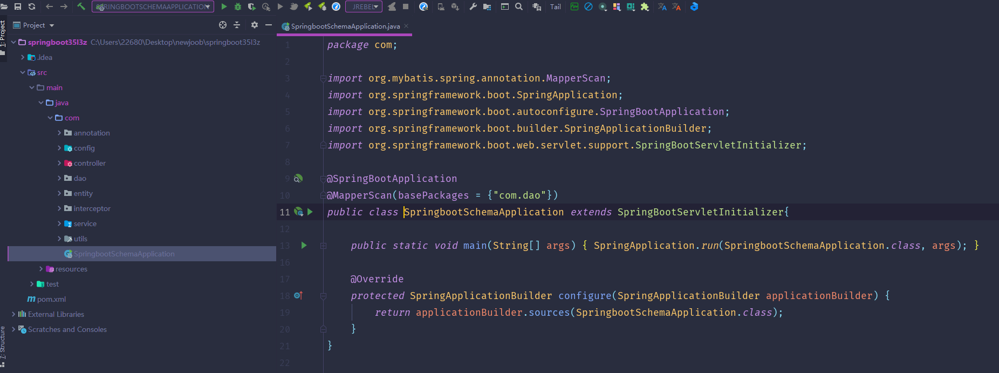

数据库表

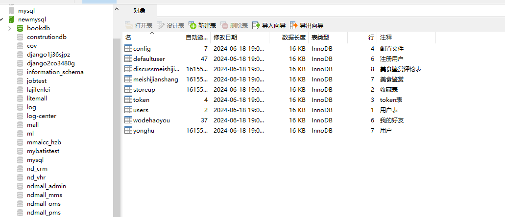

登录

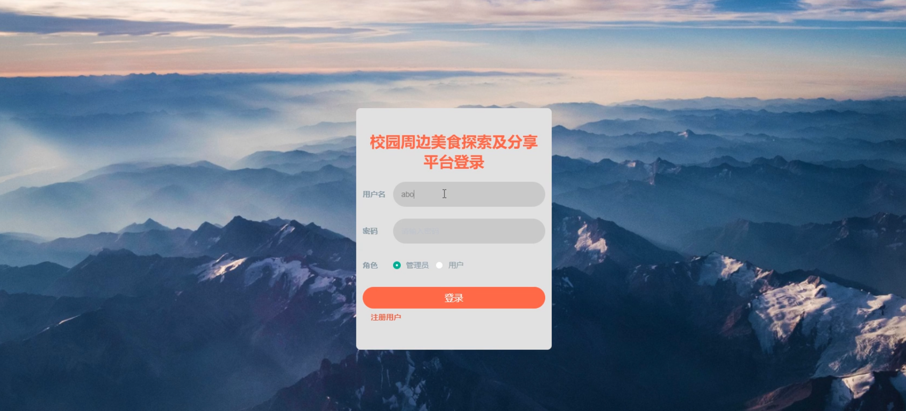

用户管理

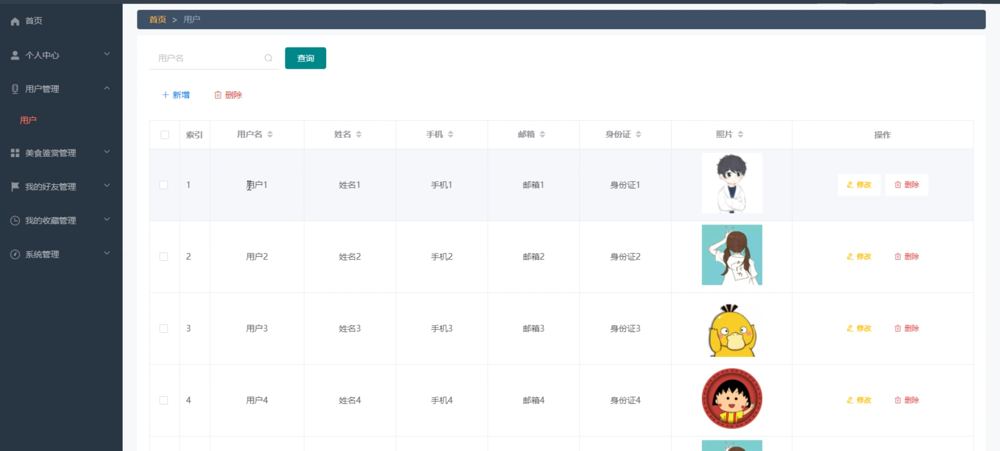

美食鉴赏管理

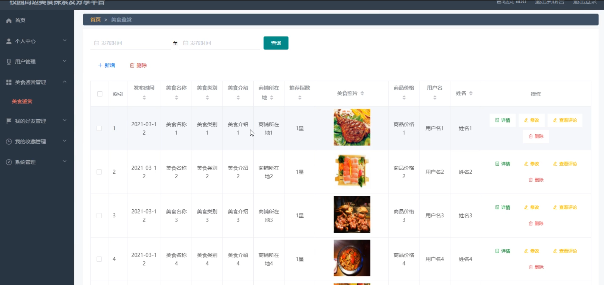

我的好友管理

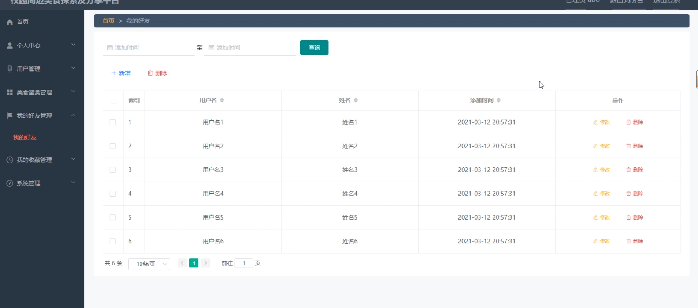

我的收藏管理

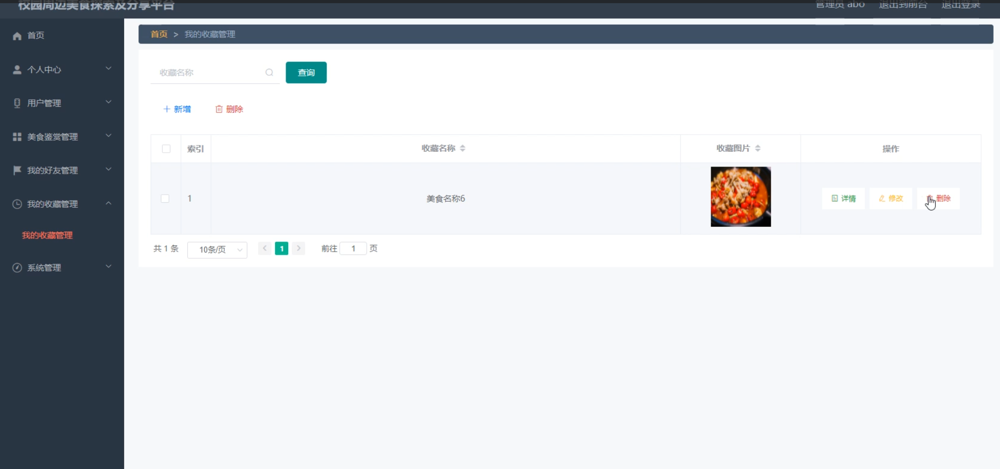

系统管理

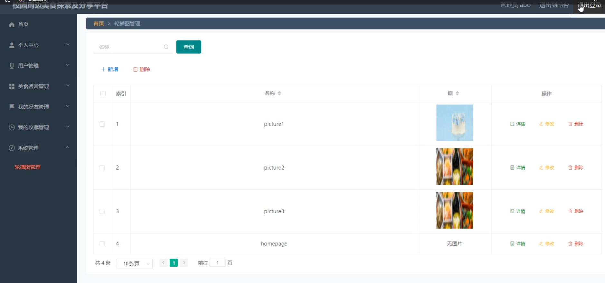

前台页面首页

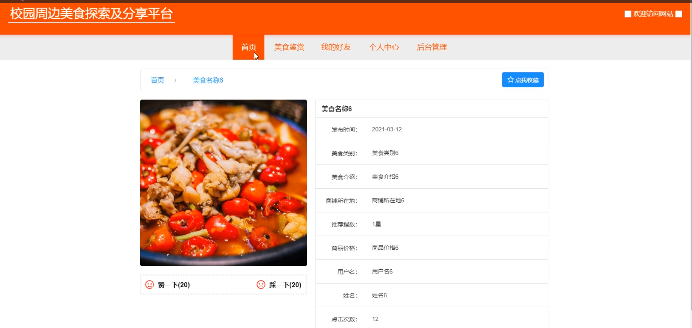

个人中心

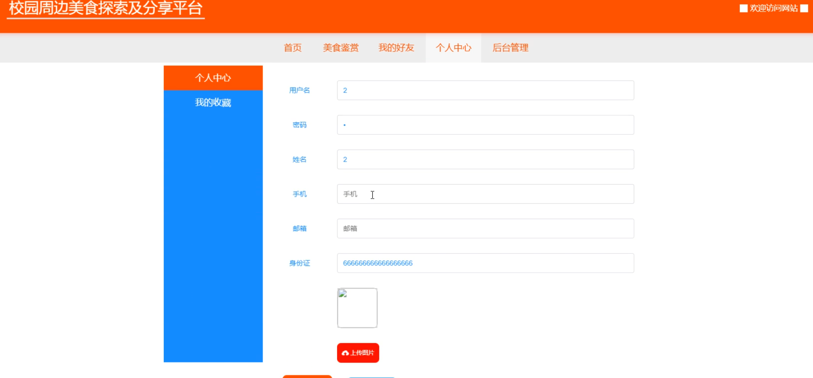

后台管理

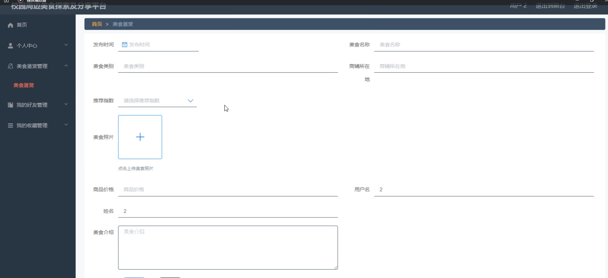

#### 总结

高校心理教育辅导系统通过分角色设计，分别为管理员和用户提供了全面的功能模块。管理员角色的高效用户管理和丰富的内容管理功能，为平台的规范运营提供了保障；用户角色的多样互动体验和个性化账户管理功能，满足了用户的多样化需求。系统通过友好的用户界面和全面的功能设计，为高校学生提供了一个丰富、有趣和安全的心理教育辅导平台，提升了整体用户体验和管理效率。

#### 使用说明

创建数据库，执行数据库脚本 修改jdbc数据库连接参数 下载安装maven依赖jar 启动idea中的springboot项目
